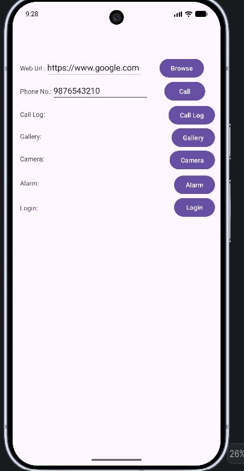
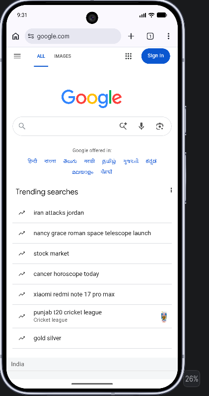
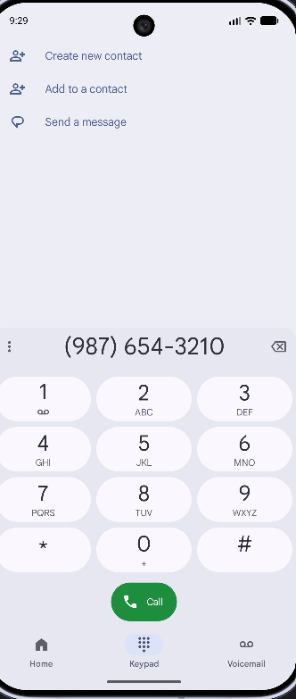
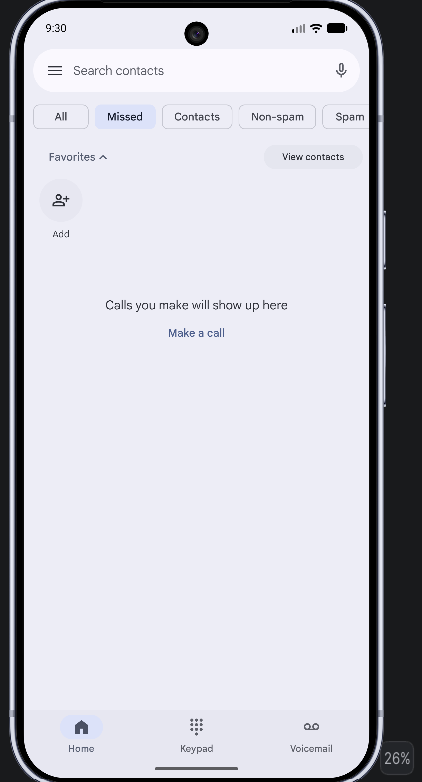
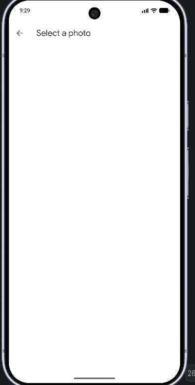
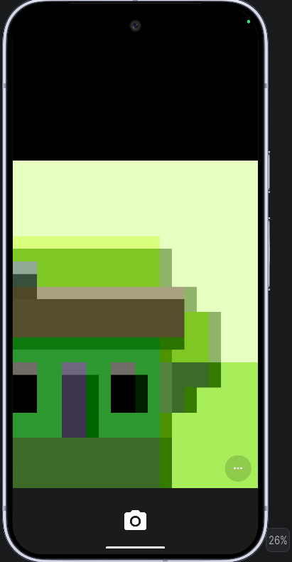
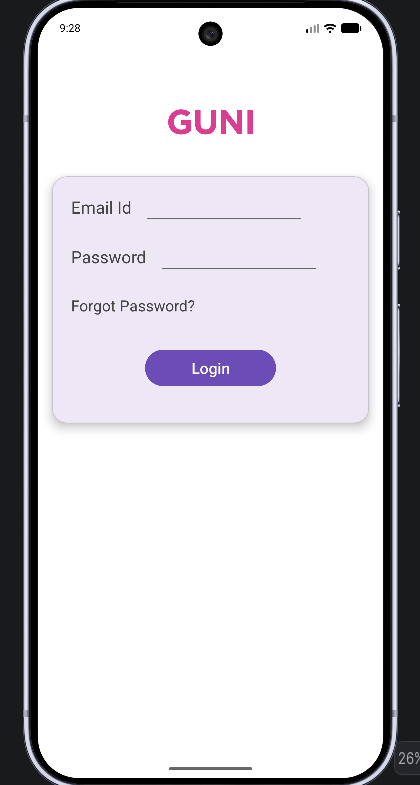

# 📱 Practical-3: Android Intent Application

## 🎯 Objective

The purpose of this practical is to develop an Android application that demonstrates the use of **Implicit Intent and Explicit Intent**.

The application is developed using **Kotlin in Android Studio** and performs several operations by communicating with Android's built-in applications as well as navigating between Activities.

---

# 🚀 Features Implemented

The application contains the following Intent-based functionalities:

| Feature           | What it does                                     |
| ----------------- | ------------------------------------------------ |
| 🌐 Open Website   | Opens a website through the default browser      |
| 📞 Make Call      | Opens the phone dialer with a specified number   |
| 📋 Call Log       | Displays the device's call history               |
| 🖼️ Gallery       | Allows the user to select an image               |
| 📷 Camera         | Starts the camera application                    |
| ⏰ Set Alarm       | Opens the alarm interface with a predefined time |
| 🔐 Login Activity | Opens the Login Activity from the main screen    |

---

# 🔄 Types of Intent Used

Android provides different ways for components to communicate with each other. In this practical, two important types are implemented.

## 🔹 Implicit Intent

An **Implicit Intent** is used when we want Android to perform a particular action without specifying the exact application that should handle it.

Android identifies an appropriate application available on the device and performs the requested operation.

In this application, Implicit Intent is used for:

* Opening a website
* Opening the phone dialer
* Accessing call history
* Selecting an image
* Starting the camera
* Setting an alarm

---

## 🔹 Explicit Intent

An **Explicit Intent** is used when the destination component is known in advance.

In this practical, the Login screen is opened by directly specifying `LoginActivity`.

Therefore, the navigation is:

```text
MainActivity → LoginActivity
```

---

# 💻 Implementation of Intent Operations

## 🌐 Open Website

The website button uses an Implicit Intent to open Google.

```kotlin
val intent = Intent(Intent.ACTION_VIEW)
intent.data = Uri.parse("https://www.google.com") 
startActivity(intent) 
```

**Purpose:** Opens Google in the default web browser.

---

## 📞 Make Phone Call

The phone functionality opens the device dialer with a predefined number.

```kotlin
val intent = Intent(Intent.ACTION_DIAL) 
intent.data = Uri.parse("tel:9876543210") 
startActivity(intent) 
```

**Purpose:** Opens the phone dialer with the given phone number.

---

## 📋 Open Call Log

The Call Log button uses an Intent to display the call history.

```kotlin
val intent = Intent(Intent.ACTION_VIEW) 
intent.type = CallLog.Calls.CONTENT_TYPE 
startActivity(intent) 
```

**Purpose:** Opens the device Call Log.

---

## 🖼️ Open Gallery

The gallery operation allows the user to choose an image.

```kotlin
val intent = Intent(Intent.ACTION_PICK) 
intent.type = "image/*" 
startActivity(intent) 
```

**Purpose:** Opens the Gallery for selecting an image.

---

## 📷 Open Camera

The camera feature launches the camera application through an Intent.

```kotlin
val intent = Intent(MediaStore.ACTION_IMAGE_CAPTURE) 
startActivity(intent) 
```

**Purpose:** Launches the Camera application.

---

## ⏰ Set Alarm

The alarm feature creates an alarm using the Android alarm Intent.

```kotlin
val intent = Intent(AlarmClock.ACTION_SET_ALARM) 
 
intent.putExtra( 
    AlarmClock.EXTRA_HOUR, 
    7 
) 
 
intent.putExtra( 
    AlarmClock.EXTRA_MINUTES, 
    30 
) 
 
intent.putExtra( 
    AlarmClock.EXTRA_MESSAGE, 
    "Wake Up" 
) 
 
startActivity(intent) 
```

**Purpose:** Creates an alarm at **7:30 AM** with the label **Wake Up**.

---

# 🔐 Explicit Intent — Login Screen

The Login button demonstrates Explicit Intent because the destination Activity is directly mentioned in the code.

```kotlin
val intent = Intent(this, LoginActivity::class.java) 
startActivity(intent) 
```

**Purpose:** Navigates from `MainActivity` to `LoginActivity`.

---

# 🎨 Application Interface

## 🏠 Main Activity

The main interface is designed in:

```text
activity_main.xml
```

The screen uses **ConstraintLayout** for arranging the different UI components.

### Components Included

* EditText for Website URL
* EditText for Phone Number
* Website button
* Phone Call button
* Call Log button
* Gallery button
* Camera button
* Alarm button
* Login Activity button

### Available Actions

From the main screen, the user can perform all the Intent operations without manually opening the corresponding applications.

---

# 🔑 Login Activity

The Login interface is created in:

```text
activity_login.xml
```

The screen contains the following elements:

* University Logo
* MaterialCardView
* Email EditText
* Password EditText
* Login Button
* Forgot Password TextView

This Activity is opened from `MainActivity` using an Explicit Intent.

---

# 🔒 Permissions

Depending on the Android implementation, the following permissions can be included in `AndroidManifest.xml`:

```xml
<uses-permission android:name="android.permission.CALL_PHONE"/> 
<uses-permission android:name="android.permission.CAMERA"/> 
```

These permissions provide access to phone calling and camera functionality when required.

> **Note:** `ACTION_DIAL` normally does not require the `CALL_PHONE` permission because it only opens the dialer instead of directly placing a call.

---

# 📸 Application Output

The following screenshots represent the different features implemented in the practical.

## 🏠 Main Screen



---

## 🌐 Website



---

## 📞 Phone Dialer



---

## 📋 Call History



---

## 🖼️ Gallery



---

## 📷 Camera



---

## ⏰ Alarm


---

## 🔐 Login Screen



---

# 🎥 Screen Recording

The working demonstration of the application is available here:

```text
https://github.com/hellyv102-sys/Practical-3/blob/main/ScreenRecording.mp4
```

The recording shows the different Intent operations performed by the application.

---

# 📂 Project Structure

The main files and folders of the application are organized as follows:

```text
Practical-3/ 
│ 
├── app/ 
│ 
├── java + kotlin/ 
│   ├── MainActivity.kt 
│   └── LoginActivity.kt 
│ 
├── res/ 
│   ├── layout/ 
│   │   ├── activity_main.xml 
│   │   └── activity_login.xml 
│   │ 
│   ├── drawable/ 
│   └── mipmap/ 
│ 
├── AndroidManifest.xml 
│ 
├── Screenshots/ 
│ 
└── README.md 
```

---

# 🛠️ Development Tools

| Tool / Technology | Application in Project                                     |
| ----------------- | ---------------------------------------------------------- |
| Android Studio    | Used for developing the Android application                |
| Kotlin            | Used to implement application functionality                |
| XML               | Used to create the user interface                          |
| ConstraintLayout  | Used for arranging interface elements                      |
| Android SDK       | Provides Android development APIs                          |
| Intent            | Used for application communication and Activity navigation |

---

# 📚 Concepts Demonstrated

## Implicit Intent

Implicit Intent is used when the application requests Android to perform an action without identifying a specific application.

### Operations demonstrated:

* 🌐 Website
* 📞 Phone Dialer
* 📋 Call Log
* 🖼️ Gallery
* 📷 Camera
* ⏰ Alarm

---

## Explicit Intent

Explicit Intent is used when the destination component is directly specified.

### Operation demonstrated:

* 🔐 `MainActivity` → `LoginActivity`

---

# 🎓 Learning Outcome

After completing this practical, the working of Android Intents can be understood through different real-world examples.

The application demonstrates how Android can:

1. Launch another application for a specific task.
2. Pass information to an external application.
3. Open device features such as the camera, dialer, gallery, and alarm.
4. Navigate between Activities within the same application.

---

# ✅ Result

The Android application was successfully developed using **Kotlin and Android Studio**.

The practical successfully demonstrates the implementation of:

### Implicit Intent

* Opening a website
* Opening the phone dialer
* Viewing call history
* Selecting an image
* Launching the camera
* Setting an alarm

### Explicit Intent

* Opening `LoginActivity` from `MainActivity`

Hence, the practical successfully demonstrates the **working and implementation of Implicit and Explicit Intents in Android**.
